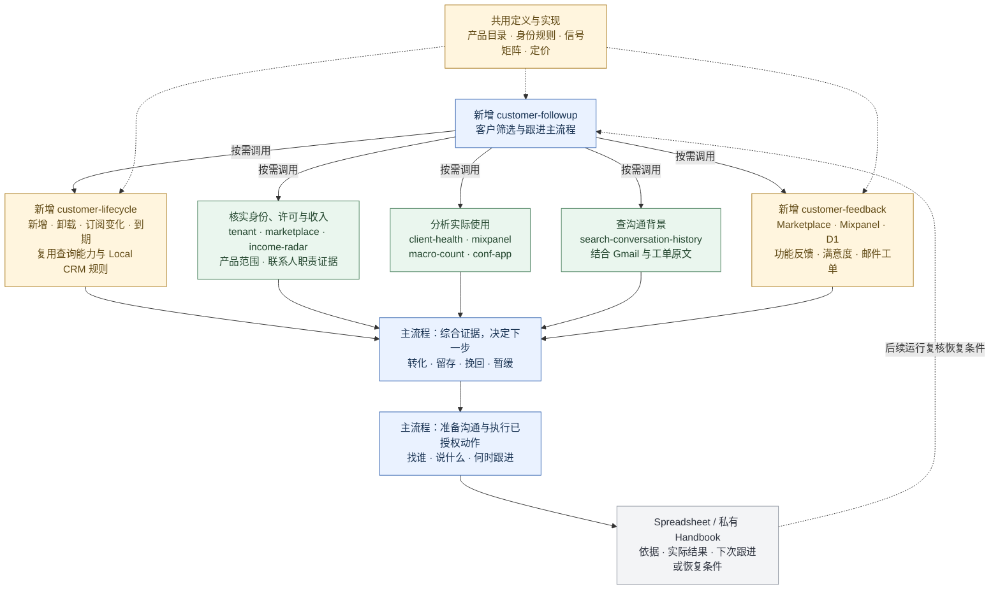

# 客户筛选与跟进：skill 关系（第一版已落地）

与 Fable 完成四轮讨论后的共同建议（2026-09-12）：新增 `customer-followup` 主流程 skill，以及可独立调用的 `customer-lifecycle` 状态查询和 `customer-feedback` 反馈查询 skill，复用其余已有能力。蓝色节点是主流程职责，绿色节点是已有 skills，黄色节点是本次新增的查询入口和共用内容，灰色节点是工作记录。

- 查询能力按具体问题选用，不要求每次全部运行。生命周期和反馈可单独回答用户问题；薄入口复用底层能力，不复制连接器或维护另一套事实规则。
- 共用节点已落地为产品目录、身份与证据规则，以及共享 Full 定价实现；查询仍逐来源报告覆盖缺口。
- 查询流程只返回事实、来源、范围与缺口，不包含联系建议或写入步骤。Markdown skill 本身不能隔离工具权限，第一版不声称具备独立执行器的权限保证。
- `customer-lifecycle` 关注新老客户的状态变化及临近期限，复用 `new-customers`、`forge-installs`、`marketplace`、`income-radar`，并对齐 Local CRM 已有的分类与证据要求。覆盖目标包括新增许可/安装、卸载、取消订阅、试用或授权到期、临近到期，以及升级/续费。已有来源是否完整支持每类信号需要逐项核实，不能从一个当前状态虚构变化日期。
- Local CRM 在当前代码中已呈现新许可、延期授权、已到期和未来到期；其到期主要由空间/用户授权的截止时间推导。试用结束、Marketplace 失效与取消在相关模型中仍有“不可推导/未核实”标记。复用其分类与证据约束，不将本地快照或演示动作结果当成最新事实或真实执行结果。
- 到期记录保留具体对象与范围：Marketplace 试用、商业许可维护期、用户/空间临时授权不能混成同一种 expired。取消订阅、邮件退订和应用卸载分别表达。Full 试用临近到期本身不自动触发催购，需结合后续计费、有效授权和实际障碍决定是否跟进。
- `new-customers` 保持新增许可候选及历史安装核对的职责。`customer-feedback` 是本次新增、可独立调用的反馈查询 skill，覆盖新老客户，不依赖新增客户名单；也可用于产品改进和问题复盘。
- `customer-feedback` 负责读取、归类并返回有来源的反馈记录，不自动发邮件、发工单或授权。是否联系、联系谁及采取什么动作，由 `customer-followup` 结合许可、使用和历史沟通决定。
- 反馈筛查覆盖 Marketplace 的取消原因与文字说明、Mixpanel 中用户实际提交的评分与文字、D1 中保存的应用内功能反馈，以及邮件、工单里的需求、问题和回复。功能反馈包括用户对具体功能的问题、缺失能力、改进建议等，不限于满意度。默认近 7 天，可扩至近 30 天；各来源分别记录覆盖时间和查询状态，缺失来源不表述为“没有反馈”。
- 应用界面是反馈的提交入口，Mixpanel 和 D1 是记录位置，同一反馈可能跨来源出现。归并时优先使用经核实可关联的提交标识；否则结合产品、站点、用户、时间与内容标记疑似重复并保留出处，不能直接相加，也不能把用户再次反馈武断去重。
- 用户主动提交的评分、文字与行为线索分开表达。Mixpanel 中的失败、放弃、关闭弹窗或停止使用可作为调查背景，不直接算作投诉；未点击提交的评分也不计入已提交满意度。
- 每条反馈记录产品、站点、发生时间、来源链接、原始诉求摘要及处理状态；结合后续使用判断是否仍有问题。取消反馈不直接等于卸载，错误事件也不能直接认定为取消原因。
- `1by1` 提供逐家审阅的节奏；发送和定时依据用户已有的明确授权执行。授权不按联系人类别扩大，一次性批次不自动加入新客户；明确持续授权按其实际范围执行。仅补齐真正缺少的执行信息，不反复确认，也不强制附加截止日。
- 沟通动作状态、机会阶段、许可/付款事实、暂缓与恢复条件分别记录，并附核实证据；不把已付款当作邮件状态的下一步。
- 后续运行主流程时复核暂缓恢复条件；图中的回线不代表已经设置持续监控或自动外发。
- `extend-space-license` 只在需要处理延期授权时调用，不作为通用联系流程。
- 分析口径、联系人策略和记录规范作为主 skill 的配套参考文件统一维护。

第一版已按本结构创建三个新 skill，修复关键旧查询和冲突规则，并更新 Sheets 的两页结构。D1 功能反馈生产覆盖和 Mini Sites 安装查询仍需在运行时核实。详见[与 Fable 的讨论结论](customer-followup-fable-review.md)和[现有 skills 审计](customer-followup-skill-audit.md)。

## 反馈数据路径核对（代码层面，2026-09-12）

- 满意度是其中一路：当前 `src/components/CSAT/CsatBanner.vue` 提交 `csat_submitted`，携带可选的 `feedback_score` 和 `feedback_text`；`src/utils/analytics/trackAnalyticsEvent.ts` 将它直接发到 Mixpanel。D1 旧事件 `csat` 的评分聚合也仍在代码中。
- 功能反馈是独立的一路：在相邻开发目录 `../conf-app-markdown-tab/` 找到 `src/features/feedback/feedbackTransport.ts`、`feedbackSession.ts`、`functions/api/feedback-report.ts` 及数据库迁移 0025–0027。该实现将正文 description、功能入口 surface、产品/站点/用户和页面上下文存入 D1 `FeedbackReport`，并支持有保留期限的可选截图。
- 这一路的 Mixpanel 事件 `feedback_report_submit_requested/succeeded/failed` 等记录提交流程，`feedbackSession.ts` 不将正文或截图写入这些事件。因此读取反馈内容需要查询 D1 报告；不能只统计 Mixpanel 成功事件，也不能把两边当成两条用户意见。
- 功能反馈保存后，用户可自愿转到工单继续交流；打开工单页面不等于已创建工单或已获回复。归并时保留反馈引用与后续工单的关联证据。
- 以上是代码路径核对，不是生产记录覆盖或部署核验。落地查询前仍需核实生产表、迁移状态、记录覆盖日期、截图可用性及来源间关联。初次审计时主检出目录缺少该实现，不能据此推导能力不存在；发布前同步最新 main 后，已确认上述功能反馈代码与迁移进入当前分支，生产覆盖仍未核验。
