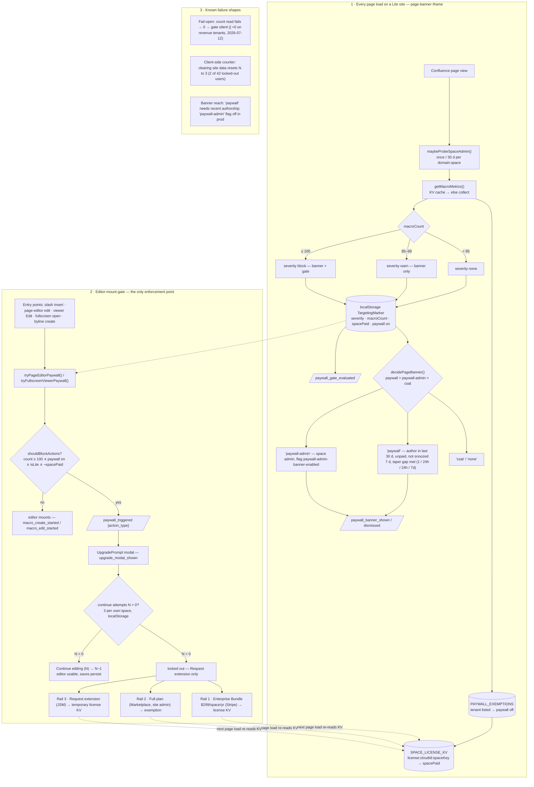

# ZenUML Lite paywall — runtime flow

Same flow as `paywall-flow.svg` (generated by `paywall-flow.gen.py` — `python3 docs/analysis/paywall-flow.gen.py`; layout follows the handbook diagram rules: orthogonal connectors on edge midpoints, one arrowhead size, one stroke width, merged trunks for converging edges, grid-quantized boxes, one documented palette with arrows colored by destination). Mermaid below is the editable sketch, not the reviewed artefact. Production, default-on since 2026-08-09 (PR #449 — Lite paywall on by default with an exemption list). Sources: `src/routes/pageBanner.ts`, `src/utils/paywall/{warningBanner,spaceAdminProbe,mountPaywallGate,continueAttempts}.ts`, `src/composables/useCustomerSuccessService.ts`, `src/services/MacroMetrics.ts`, `src/components/UpgradePrompt/UpgradePrompt.vue`.

Thresholds: warn 85 (`WARNING_THRESHOLD`, `useCustomerSuccessService.ts:11`), block 100 (`PAYWALL_BANNER_MIN_MACRO_COUNT`), 3 continue attempts (`DEFAULT_CONTINUE_ATTEMPTS`; 15 before 2026-08-16, and a stored balance is never rewritten), 7-day banner snooze (`WARNING_BANNER_SUPPRESSION_MS`), banner impression taper — 2nd/3rd ≥ 24h apart, 4th+ ≥ 7d (`BANNER_TAPER_*`, since 2026-09-07), 30-day admin probe. Lite only — Full, Diagramly and AsyncAPI run none of these gates. Spot-check rule: expect the modal at editor mount, never after Publish.
