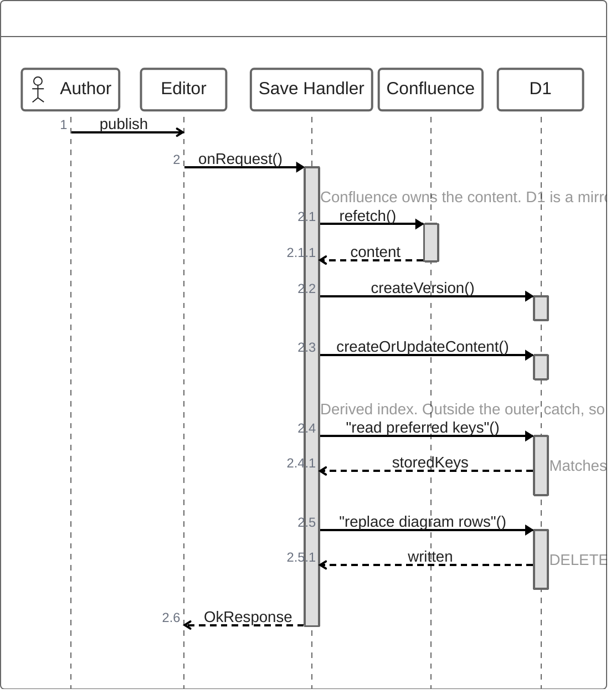

# Save-time architecture-token index

How PR #599 keeps `ArchitectureTokenOccurrence` at the version just saved, so
`service.ts` stops raising `error_kind: 'stale_index'` for Forge-saved content.

## The save path

The fence above is ZenUML, which GitHub does not render. To view it, paste the
block into a ZenUML macro, or open the
[web renderer](https://zenuml-web-renderer.zenuml.workers.dev/renderer).
Images are not committed: `.gitignore:46` ignores `*.png` repo-wide.

## Three guards, left out of the diagram

`indexDiagramOnSave` returns an outcome instead of throwing:

| Condition | Result |
|---|---|
| `apiBaseUrl` carries no cloudId | `no_cloud_id`, nothing written — the primary key needs it |
| Body is no longer a sequence diagram | DELETE runs alone, so stale rows are removed |
| D1 rejects the batch | `write_failed`, logged to Sentry, save still answers `OkResponse` |

Confluence already holds the content, so a derived table must not turn a
successful publish into a 500.

## Why a save reads before it writes

`extract-corpus.mjs` picks each key's dotted form across the **whole corpus**
(`miniappcli` → `mini.app.cli`). One save sees one diagram. Writing the naive
single-diagram key would place `miniappcli` beside the batch's `mini.app.cli`,
and the two would stop grouping together with no error raised.

`lexicalGroupingToken(x)` equals `lexicalComparisonKey(x)` with the dots removed,
so the tenant's existing choice is recoverable in one query, and
`preferComparisonKey` reuses the batch tie-break — more segments wins, then
`localeCompare` — so both writers converge on the same key.

## What this does not cover

Content created through the Confluence REST API never reaches this handler and
still needs the batch pipeline. That is the origin of the NULL-`cloudId` mirror
rows. This removes future drift; it does not backfill history.
