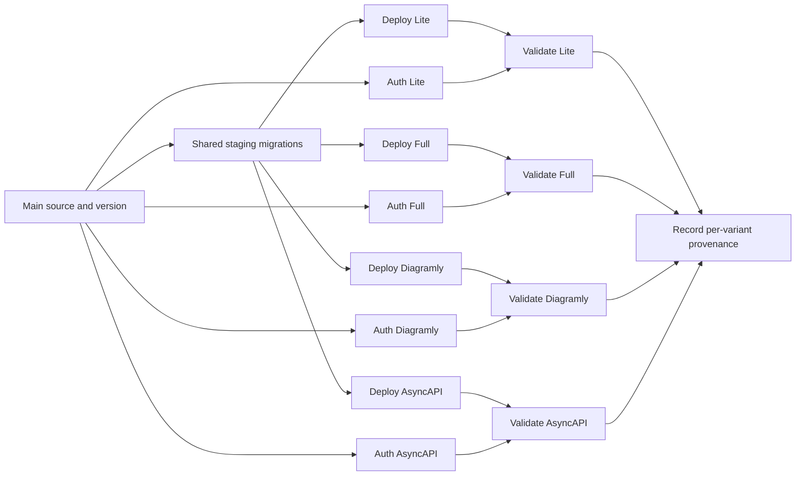

# Pipeline graphs

PR validation and main preparation have separate entry workflows.

The main graph has five jobs: Source and version, Build preparation, Staging validation, Draft preparation, and Pipeline outcome. Build preparation and Staging validation run in parallel. Each phase job links to its independent child graph and waits for the result.

The build phase contains unit tests, preview tests, production bundles, and the cron deployment. The staging phase contains deployment, login preparation, and validation for each variant. Each variant validation links to its own E2E graph, which contains plans, shards, evidence, and reports. The draft phase verifies the exact build and staging producers and creates drafts only for variants whose original validation gates passed. A failed variant still fails the root run; other eligible drafts remain available.

Every checkout uses the root source SHA. Producing run IDs and attempts are explicit. E2E children verify both their phase dispatcher and the active root owner. Only the root acquires the shared staging concurrency group. Dispatcher jobs respond to cancellation; their `always()` cleanup steps stop their own remaining children before ending.

PR selection retains smoke and Jev-selected categories, with full coverage fallback. The human `test:all` override uses the PR entry. Main applies shared staging D1 migrations once, then deploys all four variants independently. Each validator waits only for its own deploy and authentication plus the parent ownership check. Daily full regression also runs all four variant transactions independently after its shared migration gate. Full has one validator; Lite results do not gate it. Drafts retain successful build, migration, per-variant validation, and daily regression gates.

Production release order remains Diagramly → Lite → Full at least seven days after Lite; AsyncAPI is independent.

Automatic recovery listens only to root workflows. It checks the failures inside the exact phase before deciding whether they are E2E failures. Build, deploy, and draft failures prevent automatic retry. An eligible E2E failure triggers one complete root rerun, creating fresh attempt-specific producers.

## View the new graph

Start a new run from the revision containing these workflows. An old run retains its original workflow definition when rerun. Open a phase job summary for the child graph; open a variant validation summary for its test shards.

The phase workflows and root can land together: the root starts only on main, where all dispatched workflow files exist after the merge.
