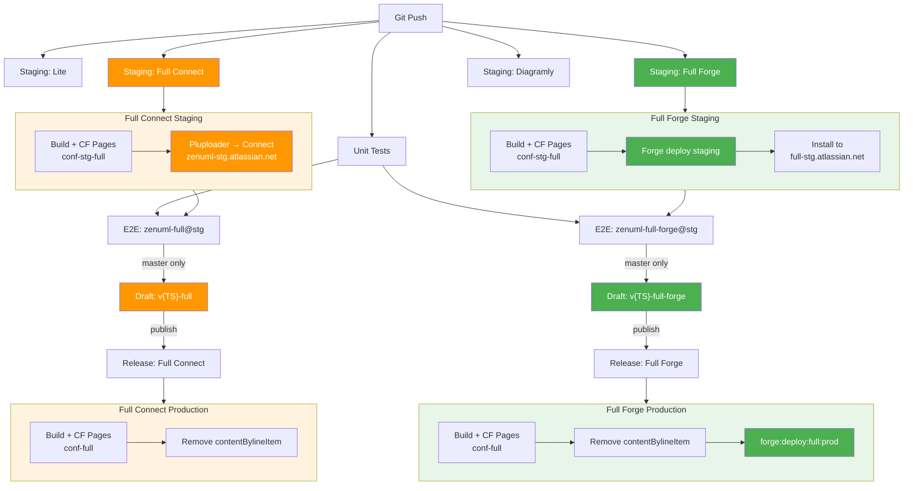

# Full Forge Release Pipeline

Two independent paths for the Full variant: Connect (existing) and Forge (new). Lite and Diagramly unchanged.

**Orange** = existing Connect path (kept for hotfixes) | **Green** = new Forge path

Lite and Diagramly paths are unchanged and omitted for clarity.
